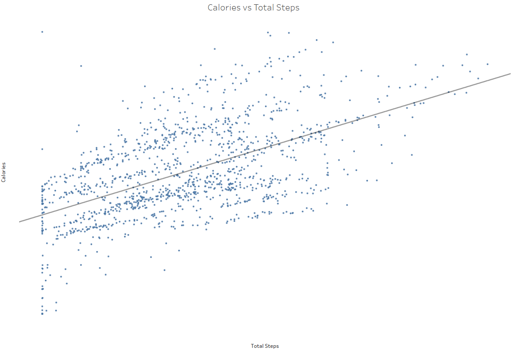
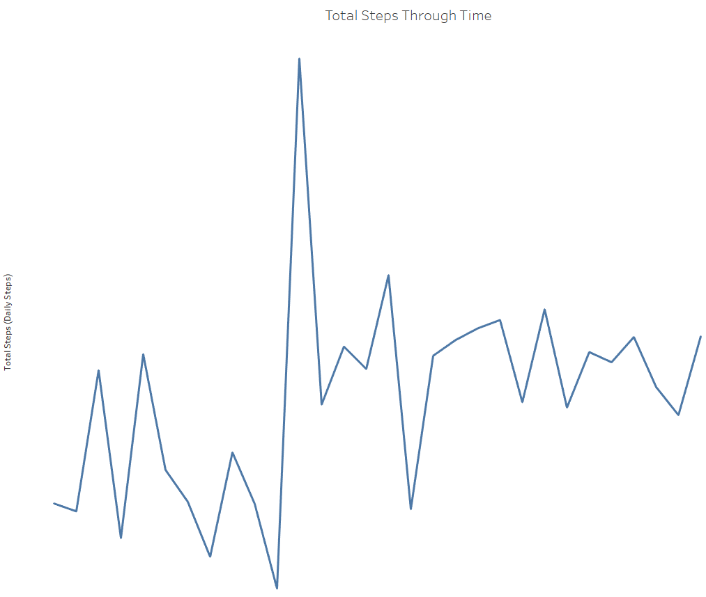
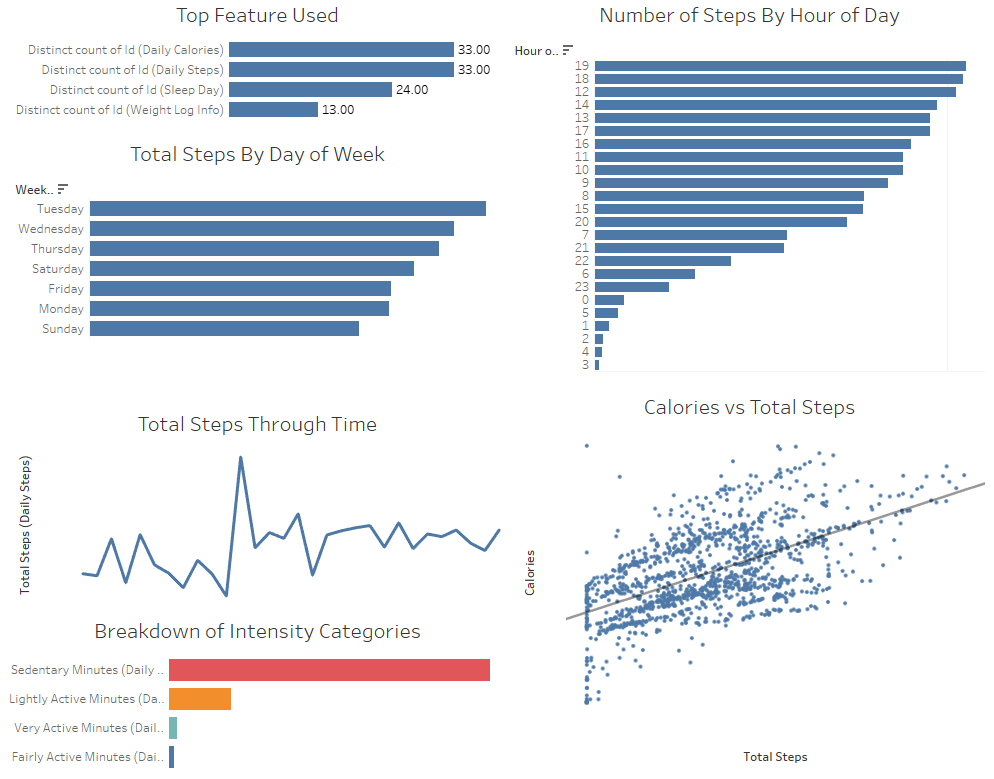

# Important Points
1)  SQL code are too large to be displayed fully and are in 9 files within "code" folder.
2)  Tableau dashboard is in .twb file within "visualisation" folder.


# Identify Objectives
## Objectives:
1) Product development recommendations based on trends found in publicly available smart device usage data
2) Marketing recommendations based on trends found in publicly available smart device usage data

## Breaking objectives down into smaller pieces
1)  Product development recommendations:
-   What are the top usage categories (e.g. for sleep pattern detection or fitness related activities)?
-   What are the metrics that strongly correlate to benefits (e.g. calory burning)?

2)  Marketing recommendations:
-   What are the age group of users (e.g. derived assumption based on heart rate)?
-   What are the usage trend?
-   What are the hours where usage is highest?

## Identify the stakeholders
1)	Urška Sršen, Co-founder of Bellabeat, Chief Creative Officer
2)	Sando Mur, Co-founder of Bellabeat and key member of the Bellabeat executive team

## Identify assumptions of using dataset from usage of 35 users
1)	Total population of 100mil total users and 85% confidence level, margin of error is 12.2%
2)  Measurements are accurate
3)  No major technology update that makes smart watch usage obsolete


# Preparations
1)  Identify publicly available data: FitBit Fitness Tracker Data
2)  Identify location of data: [Bellabeat Dataset] (www.kaggle.com/datasets/arashnic/fitbit)
3)  Integrity, bias, and credibility
-   Licensed under CCO: Public Domain license
-   Dataset is stored by user "Mobius" and made publicly accessible. Data integrity is acceptable based on business objectives
-   Dataset is in long format
-   id, date, and time fields allow for 2 options of contextual analysis;
    -   Time-based analysis
    -   Agent-based analysis


# Process
1)  Total of 10.4mil rows in 26 tables in the dataset, hence, SQL is chosen to do data cleaning and analysis
2)  Technologies used:
-   **SQL**: for data cleansing, querying, and analysis, providing critical insights
-   **PostgreSQL**: database
-   **Tableau**: tool for graphical analysis and visualizations
-   **Visual Studio Code**: code editor to execute SQL queries
-   **Git & Github**: version control and hosting my files for public access
3)  Load 26 csv files into PostgreSQL

## Data cleansing
1)  date and time values are converted from FMMM/FMDD/YYYY FMHH:FMMM:FMSS AM/PM format in [data cleansing and date conversion](code/4_data_cleansing_date_conversion.sql). Snippet of SQL code is as follows:
```
--Add new column and convert date and time format from FMMM/FMDD/YYYY FMHH12:FMMI:FMSS AM to YYYY/MM/DD and HH:MM:SS in hourly_calories_apr
ALTER TABLE hourly_calories_apr ADD COLUMN cleaned_date date;
ALTER TABLE hourly_calories_apr ADD COLUMN cleaned_time time;

UPDATE hourly_calories_apr
SET cleaned_date = (EXTRACT(YEAR FROM TO_TIMESTAMP(activityhour, 'FMMM/FMDD/YYYY FMHH12:FMMI:FMSS AM')) || '-' || EXTRACT(MONTH FROM TO_TIMESTAMP(activityhour, 'FMMM/FMDD/YYYY FMHH12:FMMI:FMSS AM')) || '-' || EXTRACT(DAY FROM TO_TIMESTAMP(activityhour, 'FMMM/FMDD/YYYY FMHH12:FMMI:FMSS AM')))::date;

UPDATE hourly_calories_apr
SET cleaned_time = (EXTRACT(HOUR FROM TO_TIMESTAMP(activityhour, 'FMMM/FMDD/YYYY FMHH12:FMMI:FMSS AM')) || ':' || EXTRACT(MINUTE FROM TO_TIMESTAMP(activityhour, 'FMMM/FMDD/YYYY FMHH12:FMMI:FMSS AMI')) || ':' || EXTRACT(SECONDS FROM TO_TIMESTAMP(activityhour, 'FMMM/FMDD/YYYY FMHH12:FMMI:FMSS AM')))::time;

--Remove unnecessary column in hourly_calories_apr
ALTER TABLE hourly_calories_apr DROP COLUMN activityhour;

--Rename columns in hourly_calories_apr
ALTER TABLE hourly_calories_apr RENAME COLUMN cleaned_date to date;
ALTER TABLE hourly_calories_apr RENAME COLUMN cleaned_time to time;
```

2)  date and time are seperated into 2 columns

3)  Columns renamed in [data cleansing drop column](code/5_data_cleansing_drop_column.sql). Snippet of SQL code is as follows:
```
--Rename columns of weight_log_info_mar
ALTER TABLE weight_log_info_mar RENAME COLUMN weightkg TO weight;
ALTER TABLE weight_log_info_mar RENAME COLUMN ismanualreport TO is_manual_report;
ALTER TABLE weight_log_info_mar RENAME COLUMN logid TO log_id;
```

4)  Check lengths of columns in [data cleansing and check length](code/6_data_cleansing_check_length.sql). Snippet of SQL code is as follows:
```
--Check length of column named id in hourly_calories_mar table
SELECT
    CASE WHEN COUNT(DISTINCT LENGTH(id::text)) > 1 THEN 'id_in_hourly_calories_mar'
        ELSE NULL END AS irregular_value_hourly_calories_mar
FROM hourly_calories_mar;
```

5)  Remove duplicates in [combine tables and remove duplicates](code/7_combine_tables_remove_duplicates.sql).

6)  Combine tables in [combine tables and remove duplicates](code/7_combine_tables_remove_duplicates.sql). Snippet of SQL code is as follows:
```
--Combine rows of hourly_calories_mar and hourly_calories_apr into hourly_calories table
SELECT *
INTO hourly_calories
FROM
(
    SELECT *
    FROM hourly_calories_mar

    UNION

    SELECT *
    FROM hourly_calories_apr
) AS hourly_calories;
```

7)  Remove nulls in [remove nulls](code/8_remove_nulls.sql). Snippet of SQL code is as follows:
```
--Remove nulls from hourly_calories table
DELETE FROM hourly_calories
WHERE id IS NULL;
```


# Analyse
## Exploratory Data Analysis
Each query aims at investigating specific aspects of the relationship between metrics and other variables that provides guidance towards choosing the appropriate marketing channel(s).
1)  Keeping in mind business objectives of product development and marketing recommendations;
-   Top features used
-   Distribution of usage throughout a week to provide insight for marketing
-   Find trend of top usage through time
-   Which intensity of exercise are these users more interested in?
-   What is the most popular duration of exercise?

2)	Missing values
-   Percentage of missing values are observed to be very high on columns like logged_activities_distance and sedentary_active_distance which suggests lack of usage, providing insight into the amount of usage for these tracking features. Based on understanding of the business domain, the missing values are not included in statistical analysis in [statistical analysis](code/9_statistical_analysis.sql) and omitted from analysis due to lack of valuable insight.
-   Percentage of missing values of tracker_distance is very low and this explains that the logging of distance during activities (logged_activities_distance) and measurement of sedentary distance (sedentary_active_distance) are features not used or activated while the device continues to track all distances in the background.
-   Product development recommendation; look into user feedback on logging of distance during activities (logged_activities_distance) and measurement of sedentary distance (sedentary_active_distance) to determine the direction of product development for these features.
-   Marketing recommendation; do not emphasize logging of distance during activities (logged_activities_distance) and measurement of sedentary distance (sedentary_active_distance) as users do not use these features.

3)  Data types
-   date and time were reformatted and provided correct data types in [data cleansing and date conversion](code/4_data_cleansing_date_conversion.sql).
-   For complete SQL code, please refer [data cleansing and date conversion](code/4_data_cleansing_date_conversion.sql). Snippet of SQL code is as follows:
```
--Add new column and convert date and time format from FMMM/FMDD/YYYY FMHH12:FMMI:FMSS AM to YYYY/MM/DD and HH:MM:SS in hourly_calories_mar
ALTER TABLE hourly_calories_mar ADD COLUMN cleaned_date date;
ALTER TABLE hourly_calories_mar ADD COLUMN cleaned_time time;

UPDATE hourly_calories_mar
SET cleaned_date = (EXTRACT(YEAR FROM TO_TIMESTAMP(activityhour, 'FMMM/FMDD/YYYY FMHH12:FMMI:FMSS AM')) || '-' || EXTRACT(MONTH FROM TO_TIMESTAMP(activityhour, 'FMMM/FMDD/YYYY FMHH12:FMMI:FMSS AM')) || '-' || EXTRACT(DAY FROM TO_TIMESTAMP(activityhour, 'FMMM/FMDD/YYYY FMHH12:FMMI:FMSS AM')))::date;

UPDATE hourly_calories_mar
SET cleaned_time = (EXTRACT(HOUR FROM TO_TIMESTAMP(activityhour, 'FMMM/FMDD/YYYY FMHH12:FMMI:FMSS AM')) || ':' || EXTRACT(MINUTE FROM TO_TIMESTAMP(activityhour, 'FMMM/FMDD/YYYY FMHH12:FMMI:FMSS AM')) || ':' || EXTRACT(SECONDS FROM TO_TIMESTAMP(activityhour, 'FMMM/FMDD/YYYY FMHH12:FMMI:FMSS AM')))::time;
```

4)  Statistical analysis (univariate analysis)
-   Numerical values are analysed to obtain
 -   Quantile statistics; min, max, median, 25th percentile, and 75th percentile
 -   Descriptive statistics; mean and standard deviation
 -   Distribution histogram
-   Categorical values are analysed to obtain
 -   Number of values
 -   Number of distinct values
-   For complete SQL code, please refer "9_statistical_analysis.sql". Snippet of SQL code is as follows:
```
--Create table for statistical analysis values for sleep_day table
CREATE TABLE sleep_day_descriptive
(
    "column" VARCHAR,
    unique_values VARCHAR,
    count VARCHAR,
    mean VARCHAR,
    standard_deviation VARCHAR,
    min VARCHAR,
    "25%" VARCHAR,
    "50%" VARCHAR,
    "75%" VARCHAR,
    max VARCHAR
);

--Statistical analysis of id column
INSERT INTO sleep_day_descriptive
VALUES
(
    'id',
    (SELECT COUNT(DISTINCT id) FROM sleep_day),
    'not applicable',
    'not applicable',
    'not applicable',
    (SELECT MIN(id) FROM sleep_day),
    'not applicable',
    'not applicable',
    'not applicable',
    (SELECT MAX(id) FROM sleep_day)
);

--Statistical analysis of total_time_in_bed column
INSERT INTO sleep_day_descriptive
VALUES
(
    'total_time_in_bed',
    (SELECT COUNT(DISTINCT total_time_in_bed) FROM sleep_day WHERE total_time_in_bed IS NOT NULL AND total_time_in_bed != 0),
    (SELECT COUNT(total_time_in_bed) FROM sleep_day WHERE total_time_in_bed IS NOT NULL AND total_time_in_bed != 0),
    (SELECT ROUND(AVG(total_time_in_bed), 0) FROM sleep_day WHERE total_time_in_bed IS NOT NULL AND total_time_in_bed != 0),
    (SELECT ROUND(STDDEV(total_time_in_bed), 0) FROM sleep_day WHERE total_time_in_bed IS NOT NULL AND total_time_in_bed != 0),
    (SELECT MIN(total_time_in_bed) FROM sleep_day WHERE total_time_in_bed IS NOT NULL AND total_time_in_bed != 0),
    (SELECT ROUND(PERCENTILE_DISC(0.25) WITHIN GROUP (ORDER BY total_time_in_bed), 0) FROM sleep_day WHERE total_time_in_bed IS NOT NULL AND total_time_in_bed != 0),
    (SELECT ROUND(PERCENTILE_DISC(0.5) WITHIN GROUP (ORDER BY total_time_in_bed), 0) FROM sleep_day WHERE total_time_in_bed IS NOT NULL AND total_time_in_bed != 0),
    (SELECT ROUND(PERCENTILE_DISC(0.75) WITHIN GROUP (ORDER BY total_time_in_bed), 0) FROM sleep_day WHERE total_time_in_bed IS NOT NULL AND total_time_in_bed != 0),
    (SELECT MAX(total_time_in_bed) FROM sleep_day WHERE total_time_in_bed IS NOT NULL AND total_time_in_bed != 0)
);
```

-   Further analysis on number of values or occurences for various categorical attributes
    -   Plotting distinct counts of features vs date (day)

    -   Calory and steps measurements are the top usage categories, followed by sleep measurement and weight measurement.
    -   Product development recommendation; emphasize on developing more features related to calories and steps measurements. These features are being used most.
    -   Marketing recommendation; do not emphasize on weight measurement feature as less than half of the users use this feature on a daily basis.
-   Plotting categories of intensities vs date (day)
 
    -   Users spend most time being sedentary.
    -   When active, users prefer to be lightly active as compared to fairly active or very active and by wide margin.
    -   Product development recommendation; development of new features should be directed towards lightly active activities instead of fairly active and very active.
    -   Marketing recommendation; do not emphasize on fairly active and lightly active activities when considering marketing campaigns as these are not what users are spending time on.
-   Further analysis on distributions
    -   Plotting total_steps vs day of week
 
        -   Users are most active on Tuesdays, followed by Wednesdays and Thursdays.
        -   Users are least active on Sundays, followed by Mondays and Fridays.
        -   Product development recommendation; consider providing customized features for routines that suit work out plans on Tuesdays, Wednesdays, and Thursdays.
        -   Marketing recommendation; since users are least active with their devices and workout on Sundays, Mondays, and Fridays, consider launching campaigns on these days to show them new features and services.
    -   Plotting number of steps vs hour of day
 
        -   Users are on the move or are working out during the hours of 7pm, followed by 6pm and 12pm.
        -   Users are least active during the window of 2am - 5am.
-   Product development recommendation; users are on the move or are working out during the period of 6pm - 8pm, so new features which offers value when moving or working out during these hours are great. Note that movements during 12pm is due lunch hour.
 -      Marketing recommendation;  since users are most active with their devices during the hours of 7pm, 6pm, and 12pm, consider launching campaigns during other hours to show them new features and services.

5)  Contextual Analysis
-   Correlation analysis
Using Tableau, Pearson Correlation Coefficient and p-value are as follows:

 -      Qualitative analysis
Plotting total_steps vs calories

Amount of calories burnt directly correlates to amount of total steps taken.
 -      Time-based analysis
Plotting total_steps vs date (day)

The trend is up through time and this shows that users are either increasing their total steps through time or are increasing their use of the device for the feature of steps measurement.

6)  Dashboard


# Recommendations
1)  Product development recommendations:
-   Emphasize on developing more features related to calories and steps measurements. These features are being used most.
-   Development of new features should be directed towards lightly active activities instead of fairly active and very active.
-   Consider providing customized features for routines that suit work out plans on Tuesdays, Wednesdays, and Thursdays.
-   Users are on the move or are working out during the period of 6pm - 8pm, so new features which offers value when moving or working out during these hours are great. Note that movements during 12pm is due lunch hour.
-   Look into user feedback on logging of distance during activities (logged_activities_distance) and measurement of sedentary distance (sedentary_active_distance) to determine the direction of product development for these features.

2)  Marketing recommendations:
-   Do not emphasize on weight measurement feature as less than half of the users use this feature on a daily basis.
-   Do not emphasize on fairly active and lightly active activities when considering marketing campaigns as these are not what users are spending time on.
-   Since users are least active with their devices and workout on Sundays, Mondays, and Fridays, consider launching campaigns on these days to show them new features and services.
-   Since users are most active with their devices during the hours of 7pm, 6pm, and 12pm, consider launching campaigns during other hours to show them new features and services.
-   Do not emphasize logging of distance during activities (logged_activities_distance) and measurement of sedentary distance (sedentary_active_distance) as users do not use these features.

3)  Closing thoughts
-   More insights into reasons of why users tend to use distance-related features less can be found by firstly obtaining feedback from customers.
-   Data from other smart devices and companies will help confirm conclusions and recommendations made.
-   Additional dataset can reinforce these recommendations as limitation of this dataset produces margin of error of 12.2% when confidence level is 85%.

--end--
